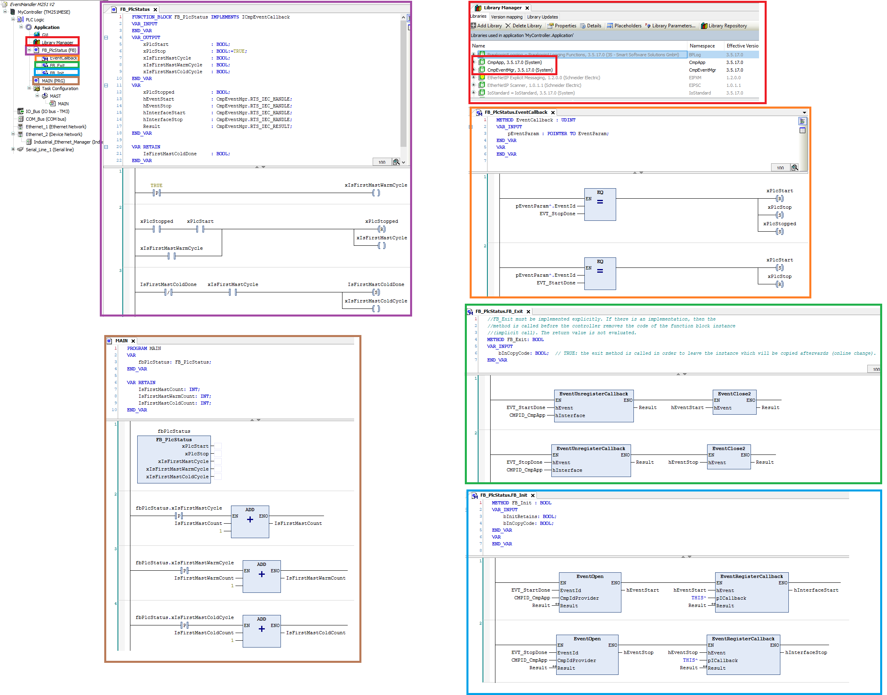

CoDeSys Function Block for PLC Status: Start, Stop, IsFirstMastCycle, IsFirstMastWarmCycle, IsFirstMastColdCycle

Copy the provided Function Block (FB) from the supplied program into the required program. The FB requires the CmpApp and CmpEventMgr libraries.

